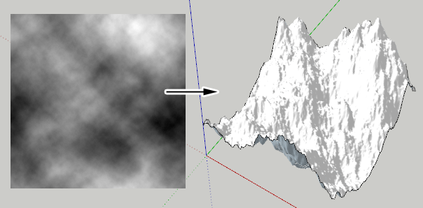
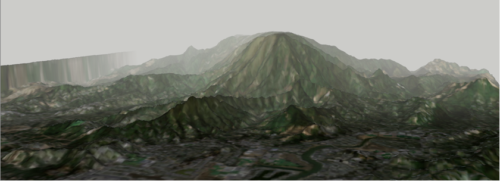
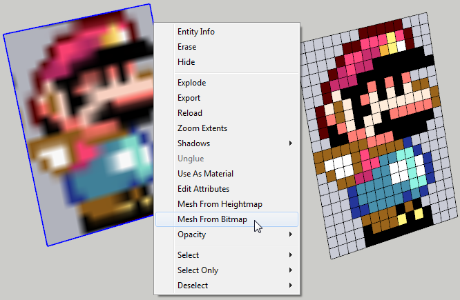

# Bitmap to Mesh

Generates a 2D or 3D mesh from a bitmap image.

From heightmaps you can easily generate terrains or any other surface.

Image entities can be converted into 2D pixel grids.

**Note!** Generates two triangles per pixel!
250x250 pixel image generates a mesh of ~125K faces! (250 * 250 * 2)
The time taken to generate a mesh quickly turns into minutes or hours - so be
careful with the bitmap sizes.

## Functionality

### Mesh from Heightmap

### Mesh from Bitmap

## Menus & Toolbars

* Draw » Mesh From Heightmap
* Context Menu » Mesh From Heightmap
* Context Menu » Mesh From Bitmap

## Requirements

* [TT_Lib² — 2.7.0](https://extensions.sketchup.com/content/tt_lib%C2%B2)

## Related Links

* [Extension Warehouse Page](https://extensions.sketchup.com/content/bitmap-mesh)
* [SketchUcation Forum Thread](http://sketchucation.com/forums/viewtopic.php?t=31339)

## CookieWare

I'd be happy if you donate a [cookie](http://www.thomthom.net/software/sketchup/cookieware/) (or a beer) if you find my plugins useful.
